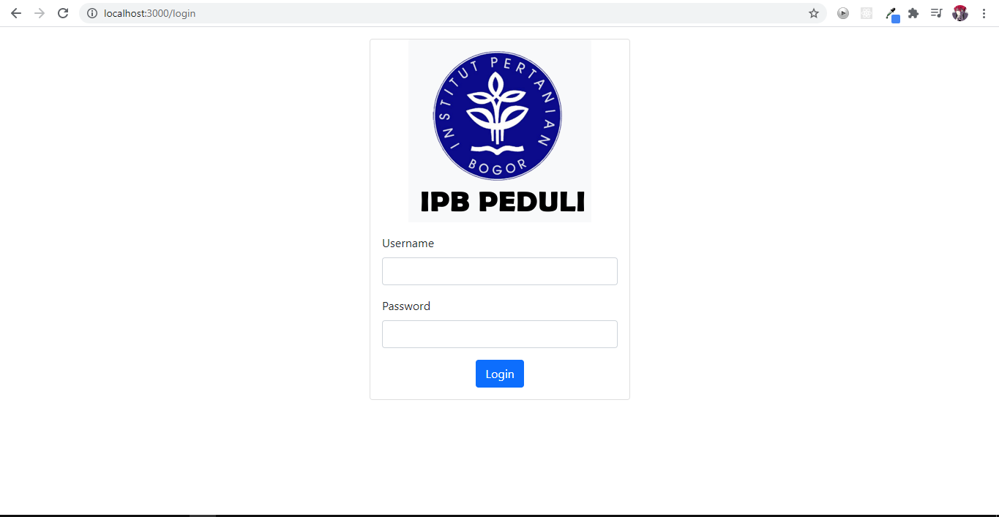
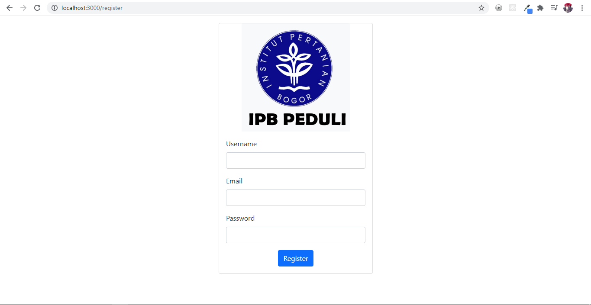

  

[Deskripsi](#-Deskripsi-Aplikasi) | [User Analysis](#-User-Analysis) | [Spesifikasi](#-Spesifikasi) | [Konsep OOP](#-konsep-OOP) | [Desain Pengembangan](#-tipe-desain-pengembangan) | [Pembahasan](#-hasil-dan-pembahasan) | [Implementasi](#-implementasi) | [Saran](#-saran) | [Developer](#-developer) |
:---:|:---:|:---:|:---:|:---:|:---:|:---:|:---:|:---:
---

# IPB PEDULI 
Tugas Akhir PSBO - P1 - Sebuah Platform untuk Berbagi

---
## Deskripsi Aplikasi
IPB Peduli merupakan sebuah platform penggalangan dana dan donasi secara online terstruktur dalam lingkup IPB. IPB Peduli membantu mahasiswa, dosen, dan civitas IPB lainnya dalam penyelenggaraan donasi. IPB Peduli yang merupakan platform berbasis web memungkinkan untuk seluruh civitas IPB untuk membuat suatu *campaign* atau turut serta berdonasi pada suatu *campaign* yang tentu dilaksanakan dalam lingkup IPB saja.

---

---
## User Analysis
### User Story
- Sebagai seorang civitas IPB, saya ingin berdonasi dalam kegiatan kemanusiaan di IPB 
- Sebagai seorang civitas IPB, saya ingin membuat sebuah campaign agar dapat membantu orang lain yang membutuhkan

---

---
## Spesifikasi Teknis Lingkungan Pengembangan
### Software
- Github
- Trello
- Figma
- Visual Studio Code
### Hardware
- Processor : intel Core i5
- RAM : 8GB 
### Tech Stack

---

---
## Konsep OOP
Konsep OOP yang digunakan dalam perangkat lunak yang dikembangkan adalah sebagai berikut :

---
---
## Tipe Desain Pengembangan
Dalam pengembangan sistem web IPB Peduli, kami menggunakan metode waterfall. Metode ini menurut kami cocok mengingat waktu pengembangan yang sempit. Metode ini merupakan metode yang sistematis dan runtut. Tahapa-tahapan yang dilakukan dalam pengembangan ini adalah sebagai berikut :
- Analisis Kebutuhan
  
Pada tahap ini, dilakukan analisis kebutuhan pengguna untuk platform yang diharapkan. Analisis Kebutuhan dapat dilakukan dengan wawancara, diskusi, maupun studi literatur.      Hasil informasi yang didapatkan kemudian akan digunakan untuk memenuhi kebutuhan pengguna.

- Sistem Desain
  
Pada sistem desain, kebutuhan software mulai dipenuhi, seperti perancangan sistem web, pembuatan use case diagram, pembuatan activity diagram, Class diagarm, arsitektur          sistem, dan interface untuk platform web.

- Impementasi sistem
  
Pada tahap ini dilakukan implementasi dari perancangan yang dilakukan pada tahap sistem desain. Sistem akan dibuat menggunakan lingkungan Node JS, JS, HTML, CSS, MongoDB,        ExpressJs, dan Github (version control). Setelah implementasi, dilakukan testing untuk mengetahui kesalahan atau kekurangan yang terdapat pada platform yang dikembangkan.

- Integrasi
  
Tahap pengintegrasian tahap-tahap yang telah dilakukan.

- Perawatan dan Operasional

---
---
## Hasil dan Pembahasan
### Use case diagram
### Activity diagram
### Class diagram
### Entity Relationship Diagram
### Arsitektur sistem

### Fungsi utama yang dikembangkan
### Fungsi CRUD

---
---
## Hasil Implementasi Perangkat Lunak
Pada bagian ini diisi screenshot hasil dan penjelasan singkat

---
---
## Saran Pengembangan
Pada pengembangannya diharapkan blablabla

---

## Developer dan Jobdesc

| Nama Anggota | NIM | Role
| ----- | ----- | ---- 
| Shibgotalloh Sabilana | G64180002  | Frontend Developer
| Abdullah Aziz Wali | G64180016  | Backend Developer
| Linggar Asmara  | G64180099  | Project Manager, UI Designer
| Firda Agustin Kartika Pratiwi | G64180116  | Dokumentasi??wkwkwkkw, UX Research
| Hudzaifah Muttaqin | G64180119  | UI Designer, UX Research

