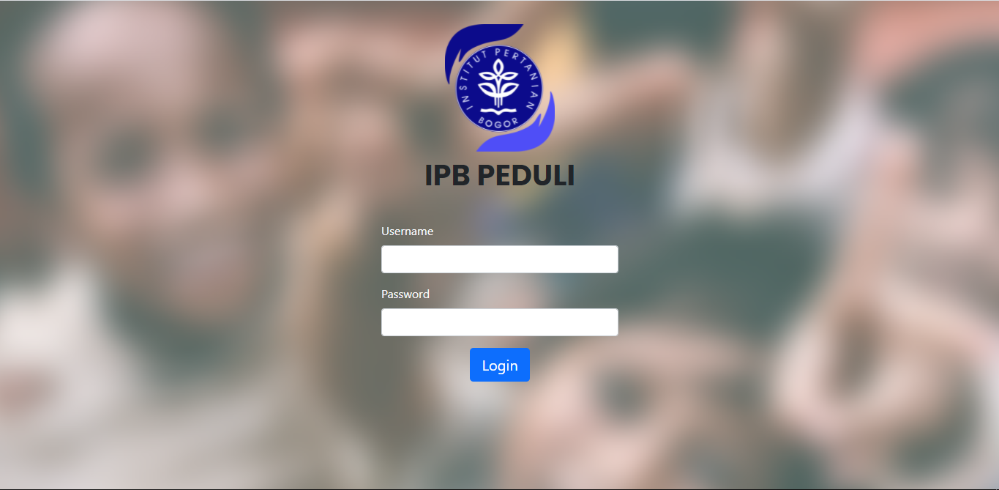
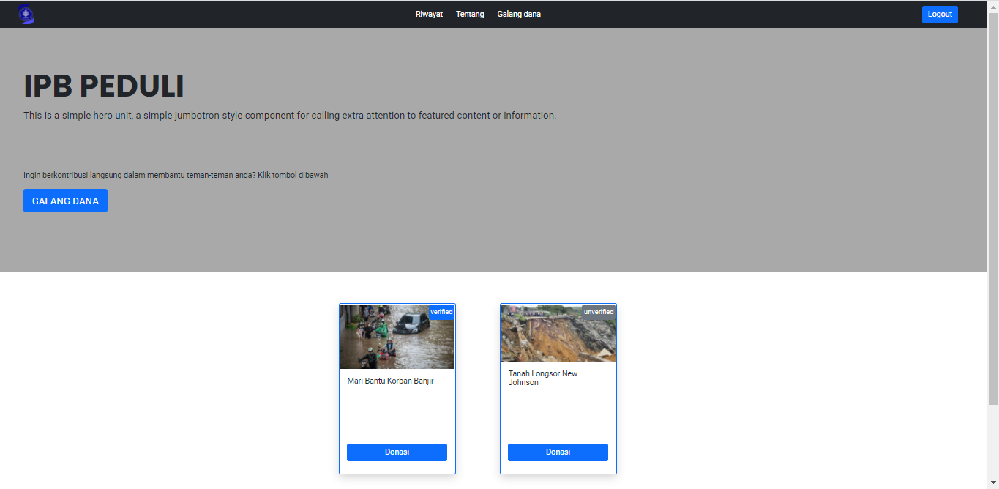
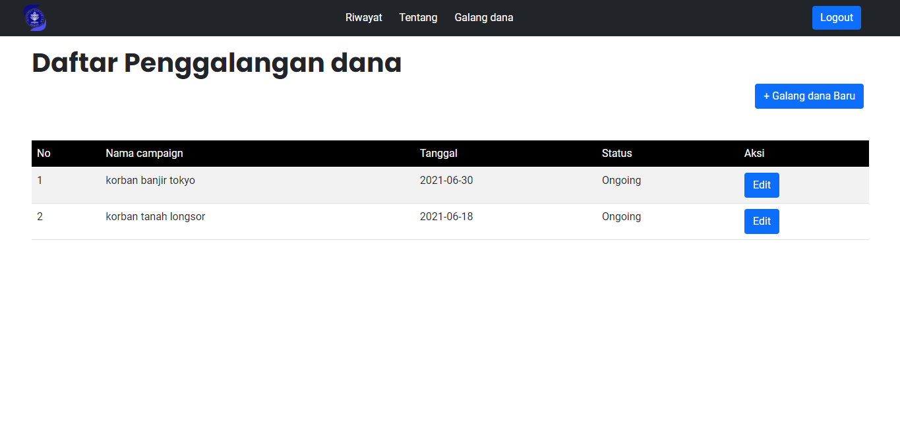
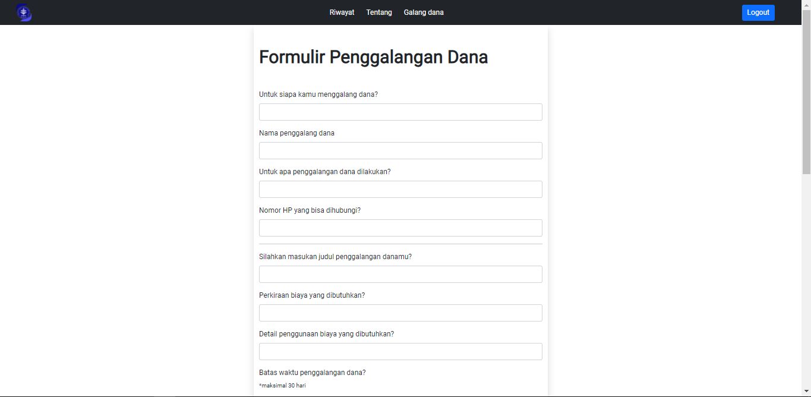
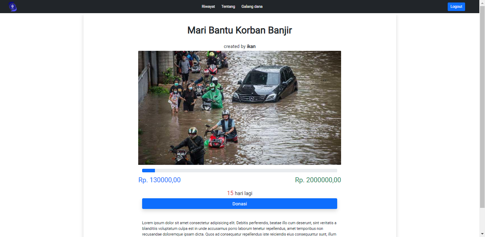
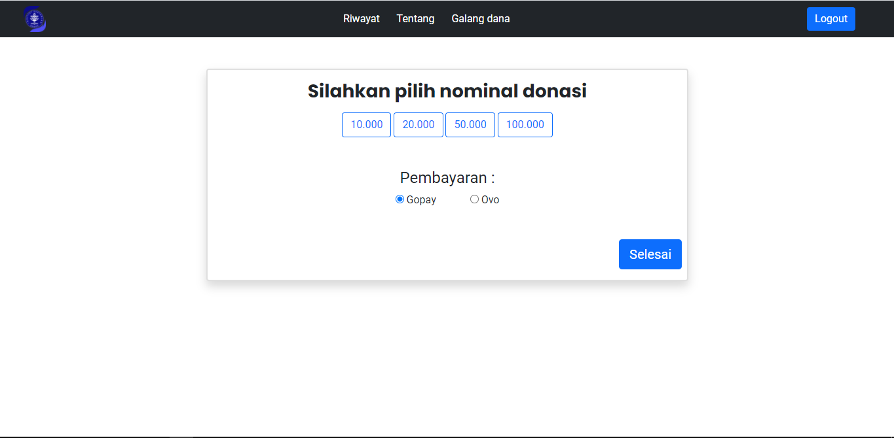
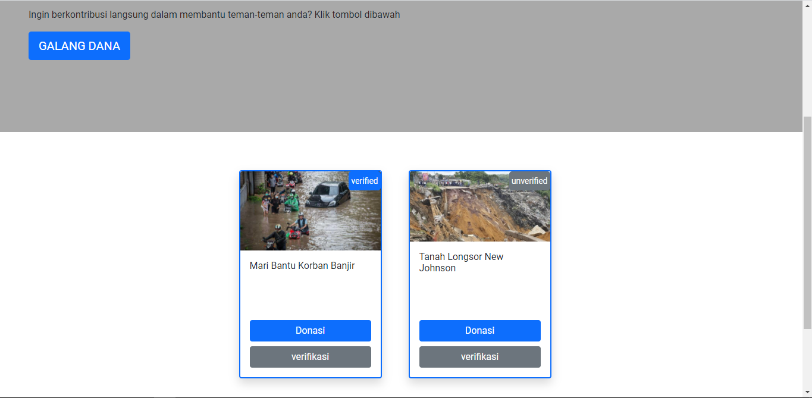
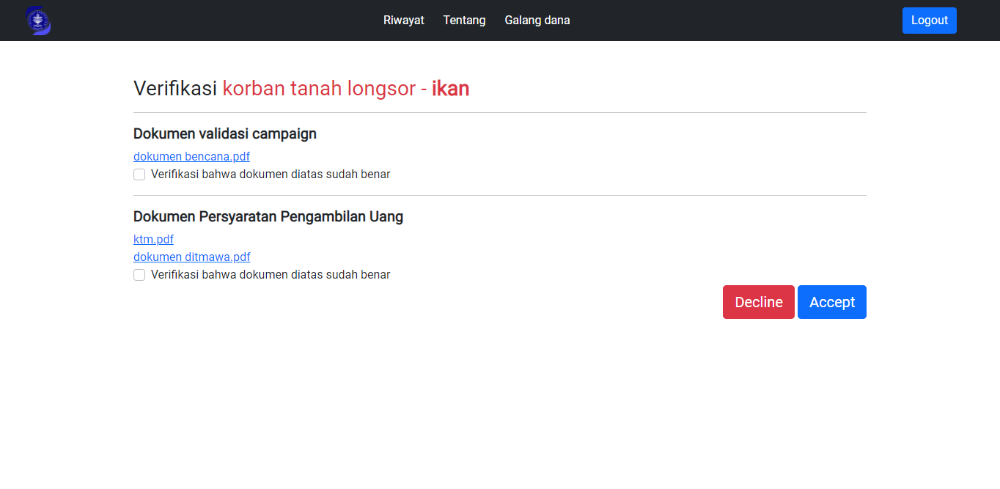
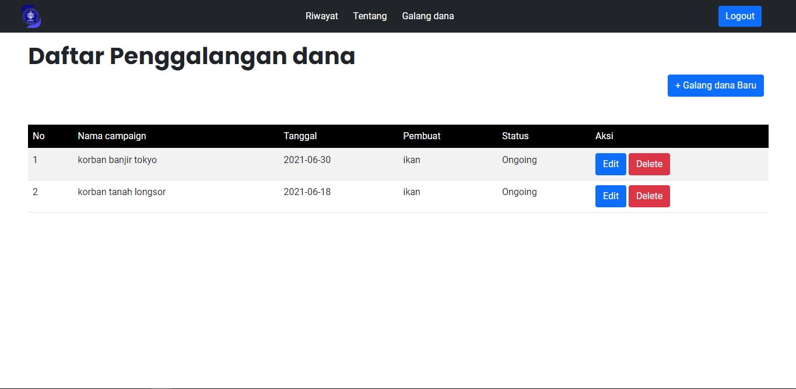

  

[Deskripsi](#-Deskripsi-Aplikasi) | [User Analysis](#-User-Analysis) | [Spesifikasi](#-Spesifikasi) | [Konsep OOP](#-konsep-OOP) | [Desain Pengembangan](#-tipe-desain-pengembangan) | [Pembahasan](#-hasil-dan-pembahasan) | [Implementasi](#-implementasi) | [Saran](#-saran) | [Developer](#-developer) |
:---:|:---:|:---:|:---:|:---:|:---:|:---:|:---:|:---:
---

# IPB PEDULI 
Tugas Akhir PSBO - P1 - Sebuah Platform untuk Berbagi

---
## Deskripsi Aplikasi
IPB Peduli merupakan sebuah platform penggalangan dana dan donasi secara online terstruktur dalam lingkup IPB. IPB Peduli membantu mahasiswa, dosen, dan civitas IPB lainnya dalam penyelenggaraan donasi. IPB Peduli yang merupakan platform berbasis web memungkinkan untuk seluruh civitas IPB untuk membuat suatu *campaign* atau turut serta berdonasi pada suatu *campaign* yang tentu dilaksanakan dalam lingkup IPB saja.

---

---
## User Analysis
### User Story
- "Sebagai seorang civitas IPB, saya ingin berdonasi dalam kegiatan kemanusiaan di IPB"
- "Sebagai seorang civitas IPB, saya ingin membuat sebuah campaign agar dapat membantu orang lain yang membutuhkan"
- "Sebagai seorang civitas IPB, saya ingin mengetahui informasi kegiatan penggalangan dana yang ada di IPB."

---
---
## Spesifikasi Teknis Lingkungan Pengembangan
### Software
- Github
- Figma
- Visual Studio Code
### Hardware
- Processor : intel Core i5
- RAM : 8GB 
### Tech Stack
 - HTML, CSS, JS, Bootstrap (Front end)
 - Node JS, MongoDB, ExpressJS (Back end)
 - Github (version control)

---

---
## Konsep OOP
- _Encapsulation_
  
Terdapat beberapa method dari object admin yang bersifat private yaitu dalam memverifikasi setiap donasi yang terdaftar

- _Abstractions_
  
Proses alur verifikasi galang dana memakai konsep abstraction. Dimana object user yang menggalang dana tidak tahu alur proses verifikasi tersebut. User hanya akan tahu          galang dananya berhasil diterima atau tidak

- _Inheritance_
- _object_
- _Method_
  
User merupakan object turunan (subclass) dari admin (superclass) dimana semua method yang digunakan oleh user dapat digunakan oleh admin sementara tidak semua method admin      dapat digunakan oleh object lainnya

---
---
## Tipe Desain Pengembangan
Dalam pengembangan sistem web IPB Peduli, kami menggunakan metode waterfall. Metode ini menurut kami cocok mengingat waktu pengembangan yang sempit. Metode ini merupakan metode yang sistematis dan runtut. Tahapa-tahapan yang dilakukan dalam pengembangan ini adalah sebagai berikut :
- Analisis Kebutuhan
  
Pada tahap ini, dilakukan analisis kebutuhan pengguna untuk platform yang diharapkan. Analisis Kebutuhan dapat dilakukan dengan wawancara, diskusi, maupun studi literatur.      Hasil informasi yang didapatkan kemudian akan digunakan untuk memenuhi kebutuhan pengguna.

- Sistem Desain
  
Pada sistem desain, kebutuhan software mulai dipenuhi, seperti perancangan sistem web, pembuatan use case diagram, pembuatan activity diagram, Class diagarm, arsitektur          sistem, dan interface untuk platform web.

- Impementasi sistem
  
Pada tahap ini dilakukan implementasi dari perancangan yang dilakukan pada tahap sistem desain. Sistem akan dibuat menggunakan lingkungan Node JS, JS, HTML, CSS, MongoDB,        ExpressJs, dan Github (version control). Setelah implementasi, dilakukan testing untuk mengetahui kesalahan atau kekurangan yang terdapat pada platform yang dikembangkan.

- Integrasi
  
Tahap pengintegrasian tahap-tahap yang telah dilakukan.

- Perawatan dan Operasional

---
---
## Hasil dan Pembahasan
### Use case diagram

### Activity diagram

### Class diagram

### Entity Relationship Diagram

### Arsitektur sistem

### Fungsi utama yang dikembangkan
### Fungsi CRUD

---
---
## Hasil Implementasi Perangkat Lunak
Pada bagian ini diisi screenshot hasil dan penjelasan singkat

---
---
## Saran Pengembangan
Saran
Dalam Pengerjaan Project ini, kami menemui beberapa kendala terutama dalam urasi waktu pengerjaan. baik dalam manajemen waktu team, maupun waktu yang diberikan.Pada pengembangan project selanjutnya diharapkan team dapat lebih memanajemen waktu. Kami menggunakan framework bootstrap dalam frontend website kami, mungkin dalam pengembangan lain dapat menggunakan framework lain agar didapatkan hasil yang lebih baik

---

## Developer dan Jobdesc

| Nama Anggota | NIM | Role
| ----- | ----- | ---- 
| Shibgotalloh Sabilana | G64180002  | Frontend Developer
| Abdullah Aziz Wali | G64180016  | Backend Developer
| Linggar Asmara  | G64180099  | Project Manager, UI Designer
| Firda Agustin Kartika Pratiwi | G64180116  | System Analyst
| Hudzaifah Muttaqin | G64180119  | UI Designer

